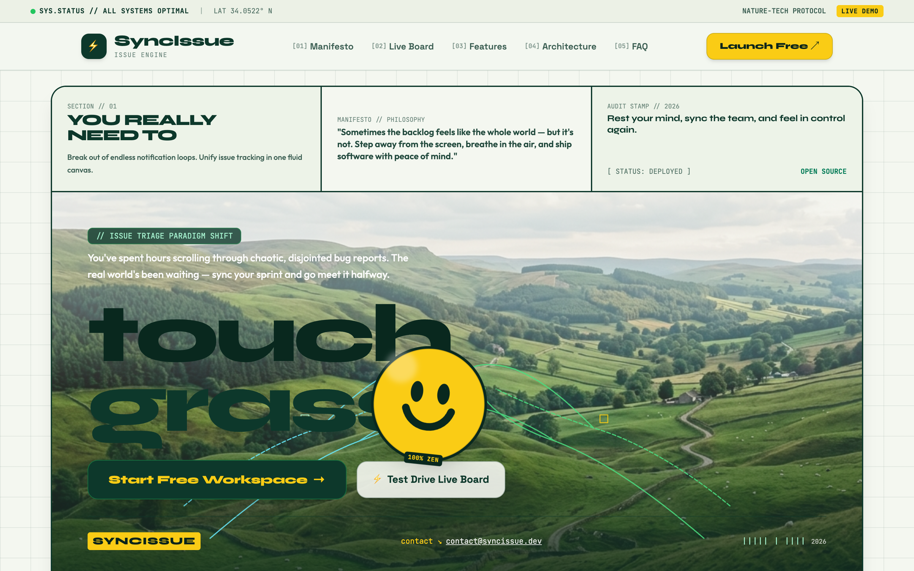
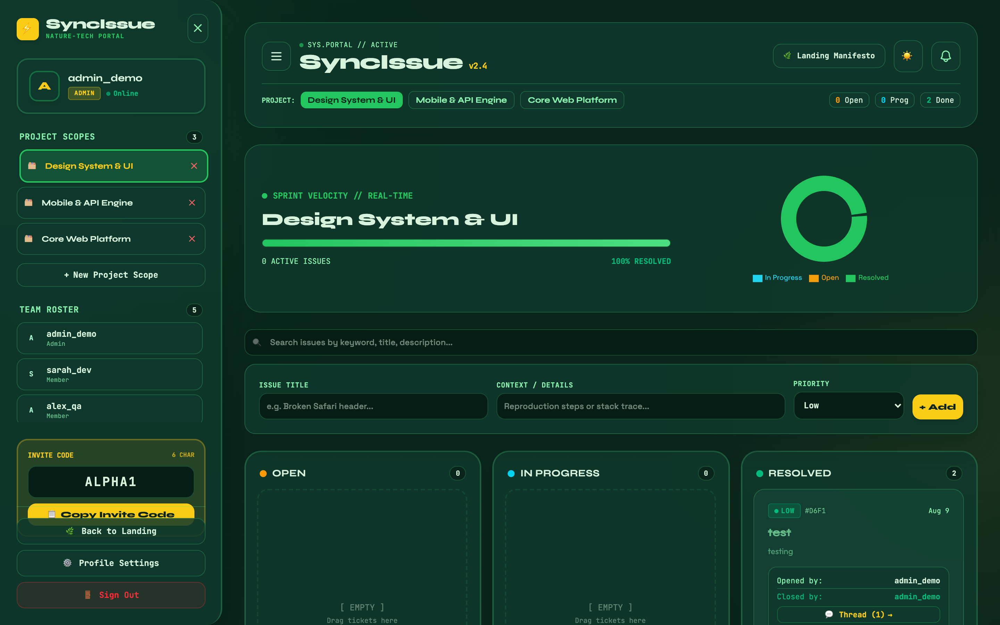
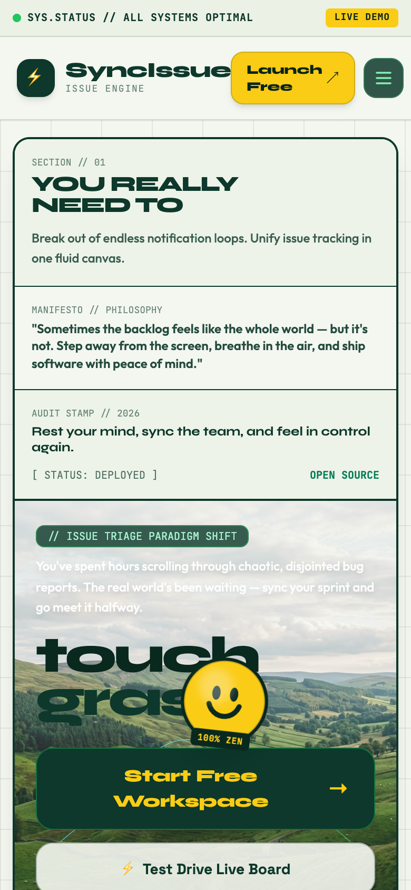
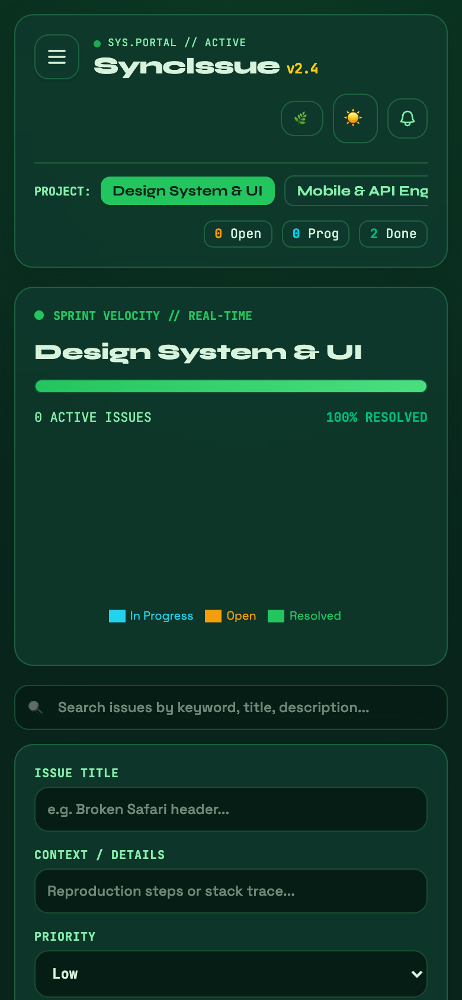

<div align="center">

# ⚡ SyncIssue

### *Nature-Tech Issue Triage & Engineering Sprint Management Platform*

A high-velocity, intuitive, and beautifully crafted issue tracking platform designed with a **Nature-Tech Editorial aesthetic**, pairing deep forest pine greens, meadow glows, and bold typography with fluid drag-and-drop Kanban triage.

[](https://full-stack-bug-tracker.vercel.app)
[](https://full-stack-bug-tracker.onrender.com/api/tickets)
[](#-tech-stack-galaxy)

<br/>

_“Sometimes the backlog feels like the whole world — but it's not. Step away from the screen, breathe in the air, touch grass, and ship with clarity.”_

</div>

---

## 📸 Real Application Showcase & Screenshots

### 1. 🌿 Editorial "Touch Grass" Landing Page
> The introductory poster landing page featuring Syne & Space Grotesk typography, interactive Kanban test-drive simulator, crinkled smiley sticker badge, and architectural bento showcase.

<div align="center">
  
</div>

<br/>

---

### 2. 📋 Interactive Kanban Dashboard & Sprint Analytics (Dark & Light Mode)
> Real-time Trello-grade drag & drop pipelines with sprint velocity progress indicators, system health donut charts, multi-project silos, and live notification bells.

<div align="center">
  
</div>

<br/>

---

### 3. 💬 Live Ticket Discussions & Cryptographic Resolution History
> Threaded discussion context attached to every issue with immutable timestamps and resolution audit signatures (`✓ Resolved by @user at timestamp`).

<div align="center">
  
</div>

<br/>

---

### 4. 📱 Flawless Mobile Responsiveness
> Mobile snap-scrolling Kanban grids (`snap-x snap-mandatory`), mobile column switcher tabs, and off-canvas team roster sidebars.

<div align="center">
  <table width="100%">
    <tr>
      <td align="center" width="50%">
        <b>Mobile Landing Page</b><br/><br/>
        
      </td>
      <td align="center" width="50%">
        <b>Mobile Workspace Portal</b><br/><br/>
        
      </td>
    </tr>
  </table>
</div>

---

## 🔥 Core Platform Features

- 🏢 **Team Workspaces & 6-Character Invite Codes:** Create team clusters (e.g. `Alpha Engineering`) and onboard teammates in seconds using unique alphanumeric codes (`#ALPHA1`). Admins manage roster permissions and can remove members dynamically.
- 🗂️ **Multi-Project Scoping:** Keep tickets siloed across different microservices, repositories, or client scopes without page reloads.
- 📋 **Fluid Touch Drag & Drop Kanban:** Interactive columns (**Open**, **In Progress**, **Resolved**) powered by `@hello-pangea/dnd` with smooth physics across mobile touchscreens and desktop viewports.
- 💬 **Real-time Embedded Discussions:** Threaded comment streams attached to every ticket for rapid debugging, reproduction steps, and stack trace sharing.
- 🔔 **Drop-Down Live Notifications:** Real-time alert bell notifying users when teammates comment, mention them, or update resolution states.
- 📜 **Full Resolution Accountability Trail:** Cryptographic-grade audit logs tracking who opened an issue, who resolved it, and exact server timestamps.
- 🎨 **Nature-Tech Editorial Design System:** A curated color palette of deep pine greens (`#08241b`, `#0d382b`), meadow gradients (`#22c55e`), and sunny sticker yellow (`#facc15`). Includes smooth Light/Dark mode toggling.
- 🔒 **Secure Stateless Authentication:** JWT token authentication, Bcrypt password hashing, and role-based access control (Admin vs. Member).

---

## 💻 Tech Stack Galaxy

| **Layer** | **Technology** | **Why?** |
| :--- | :--- | :--- |
| **Frontend** | `React 19` + `Vite 7` | Instant Hot Module Replacement (HMR), `@hello-pangea/dnd` drag physics, and `Recharts` data visualization. |
| **Styling** | `Tailwind CSS v4` | Modern utility architecture with radial gradients, glassmorphism, and responsive snap scrolling. |
| **Backend** | `Node.js` + `Express 5` | Non-blocking RESTful routing architecture for low-latency JSON CRUD and notifications. |
| **Database** | `MongoDB` + `Mongoose` | Relational document embedding (Users → Teams → Projects → Tickets → Comments). |
| **Security** | `JWT` + `Bcrypt.js` | Stateless session payloads carrying Role and Team workspace context. |

---

## 🔑 Pre-Seeded Demo Test Accounts

The local database includes pre-configured candidate accounts ready for testing:

| **Role** | **Username** | **Password** | **Team Workspace** | **Invite Code** |
| :--- | :--- | :--- | :--- | :--- |
| 👑 **Team Lead / Admin** | `admin_demo` | `password123` | `Alpha Engineering` | `ALPHA1` |
| 🧑‍💻 **Developer (New Dev)** | `new_dev_user` | `password123` | `Alpha Engineering` | `ALPHA1` |
| 💻 **Frontend Lead** | `sarah_dev` | `password123` | `Alpha Engineering` | `ALPHA1` |
| 🔍 **QA Engineer** | `alex_qa` | `password123` | `Alpha Engineering` | `ALPHA1` |

---

## 🚀 Quick Start Guide

Run the full platform locally in less than 2 minutes.

### 1. Clone the Repository
```bash
git clone https://github.com/MahmoudEsawi/Full-stack-Bug-Tracker.git
cd Full-stack-Bug-Tracker
```

### 2. Configure & Start Backend
```bash
cd backend
npm install
```

Create a `.env` file in `backend/.env`:
```env
MONGO_URI=mongodb://127.0.0.1:27017/bug-tracker
PORT=5002
JWT_SECRET=supersecretkey_dev_syncissue_123
```

Seed demo test data & launch server:
```bash
node seed_demo.js
npm run dev
```

### 3. Launch Frontend Client
In a fresh terminal window:
```bash
cd frontend
npm install
npm run dev
```

Open your browser at **`http://localhost:5174`** to experience the landing page and workspace portal!

---

<div align="center">
  <p>Engineered with ☕ and passion by <b>Mahmoud Esawi</b>.</p>
</div>
